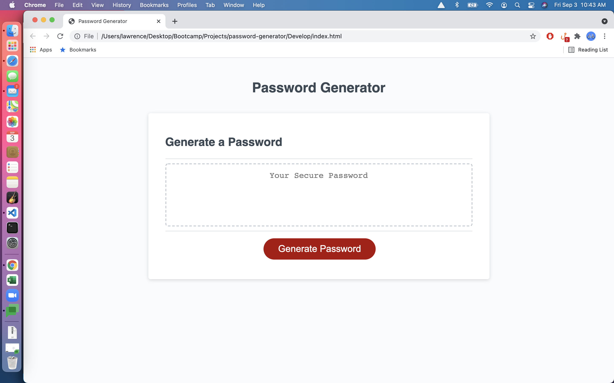
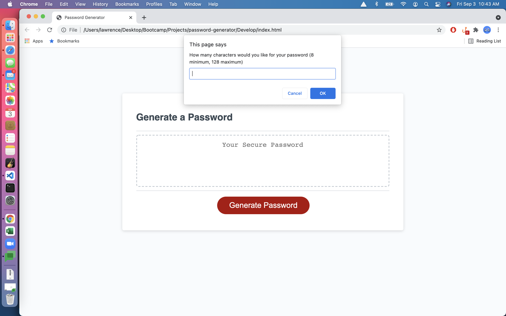
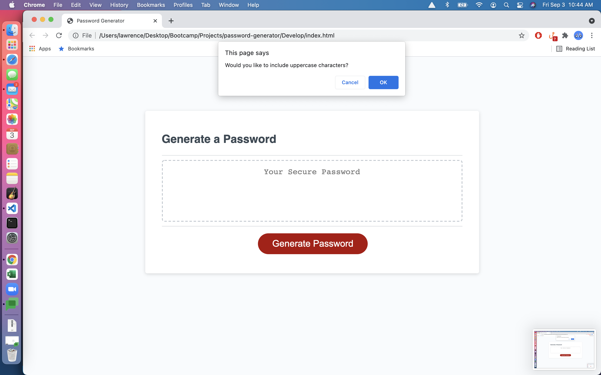
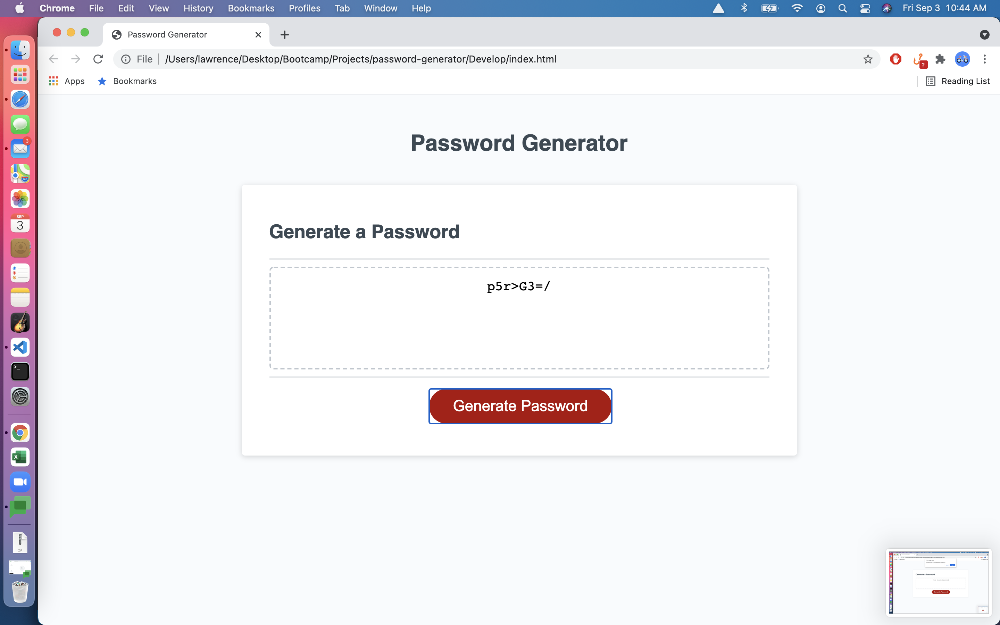

# Password Generator Starter Code

Module 3 Challenge

This is the module 3 challenge for the GW Coding Bootcamp course submitted by Lawrence Rivales.

Summary of changes:
1.  Added prompts for password length, uppercase, lowerchase, numeric, and special characters.
2.  Added function for generating a random password.
3.  Added function for resetting the variables.

URL can be reached here: https://lrivales.github.io/password-generator/

Snapshots can be seen here:

